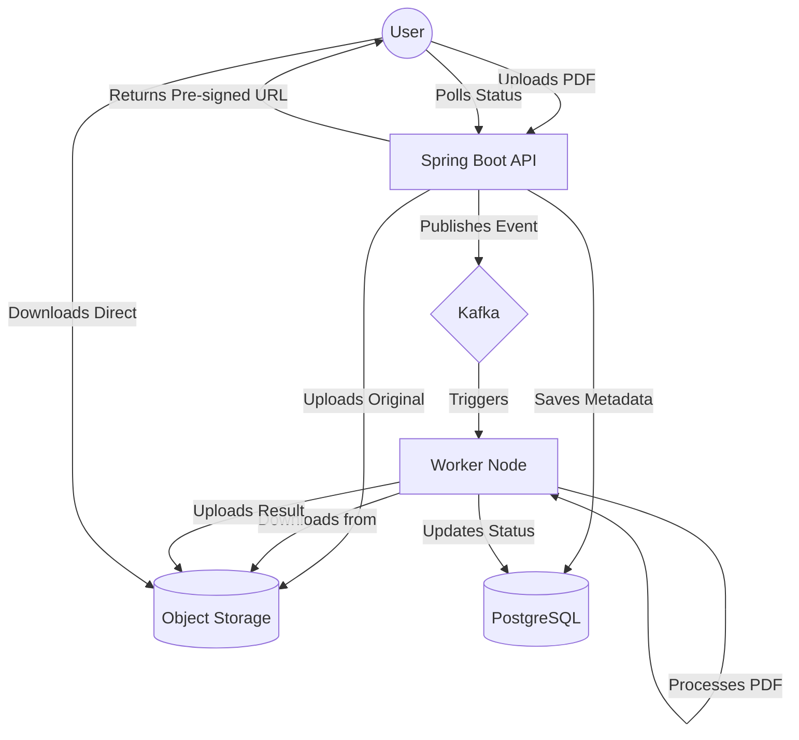

# Production Storage Strategy for PDFStation

This document outlines the recommended storage strategies for PDFStation when moving from development to production.

## Overview

In development, we use local file system storage. However, for production, local storage is not recommended due to:
- **Ephemeral nature**: Containers (like Render/Vercel) lose local data on restart.
- **Scalability**: Local disks cannot easily scale or be shared across multiple backend instances.
- **Durability**: No built-in redundancy or backups.
- **Cost**: Local storage is often more expensive than object storage for high volumes.

## Recommended Solutions

### 1. Cloud Object Storage (Best Strategy) ⭐

AWS S3, Google Cloud Storage, or Azure Blob Storage are the industry standard for file storage.

**Advantages:**
- **Scalability**: Virtually unlimited storage.
- **Durability**: Extremely high durability (99.999999999%).
- **Pre-signed URLs**: Secure temporary access for downloads without proxying through the backend.
- **CDN Integration**: Fast global delivery via CloudFront or similar.

#### Recommendation: Cloudflare R2
For PDFStation, **Cloudflare R2** is the most cost-effective choice because:
- **Zero Egress Fees**: Unlike AWS S3 (which charges ~$0.09/GB for downloads), R2 has $0 egress fees.
- **S3-Compatible API**: Uses the same SDKs as AWS S3.
- **Generous Free Tier**: 10GB free storage included.

### 2. Hybrid Approach (For Free Tiers)

If you must stay on a zero-budget free tier without an S3 provider, use local storage with a cleanup policy.

**Implementation Tip:**
Implement a scheduled task to delete files older than 24-48 hours.
```java
@Scheduled(cron = "0 0 2 * * ?") // Daily at 2AM
public void cleanup() {
    // Delete files older than X hours
}
```

## Proposed Architecture



## Implementation Guide

### 1. Dependency
Add the S3 SDK to `pom.xml`:
```xml
<dependency>
    <groupId>software.amazon.awssdk</groupId>
    <artifactId>s3</artifactId>
    <version>2.20.x</version>
</dependency>
```

### 2. Interface Abstraction
Keep the `FileStorageService` interface but add an S3 implementation:
```java
public interface StorageService {
    String store(MultipartFile file);
    InputStream load(String key);
    String generateDownloadUrl(String key);
}
```

### 3. Toggling Implementations
Use Spring `@ConditionalOnProperty` to switch between `LocalFileStorage` and `S3FileStorage` via `application.properties`.

```properties
# Local storage for dev
storage.provider=local
storage.local.dir=./uploads

# S3 storage for prod
storage.provider=s3
storage.s3.bucket=pdfstation-prod
storage.s3.region=us-east-1
```

## Cost Comparison

| Provider | Storage (per GB) | Egress/Download (per GB) |
| :--- | :--- | :--- |
| **AWS S3** | ~$0.023 | ~$0.09 |
| **Google Cloud** | ~$0.020 | ~$0.12 |
| **Cloudflare R2**| ~$0.015 | **$0.00 (Free)** |
| **DigitalOcean** | $0.020 | $0.01 |

## Conclusion
For a production-grade PDFStation, **Cloudflare R2** offers the best balance of cost-efficiency and S3-compatibility, ensuring users can download their results without incurring massive bandwidth bills.
